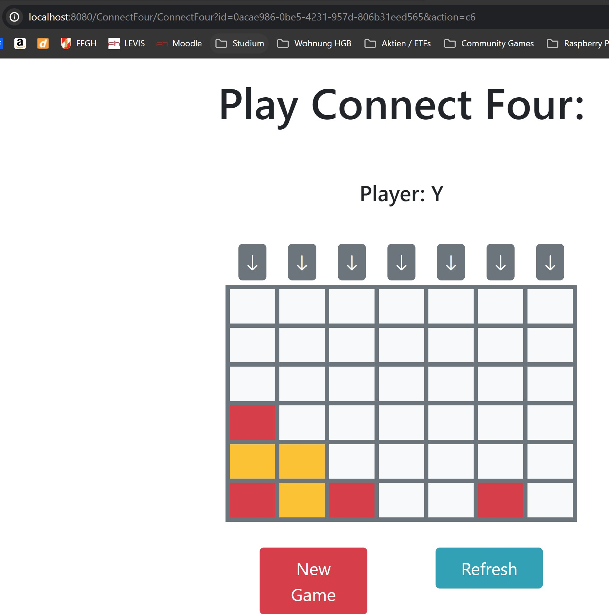
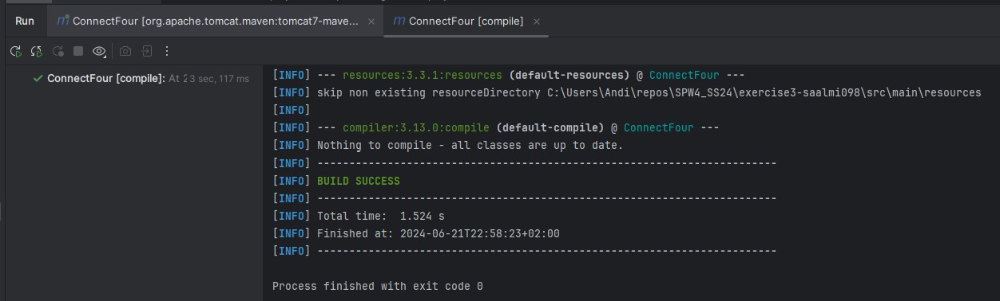
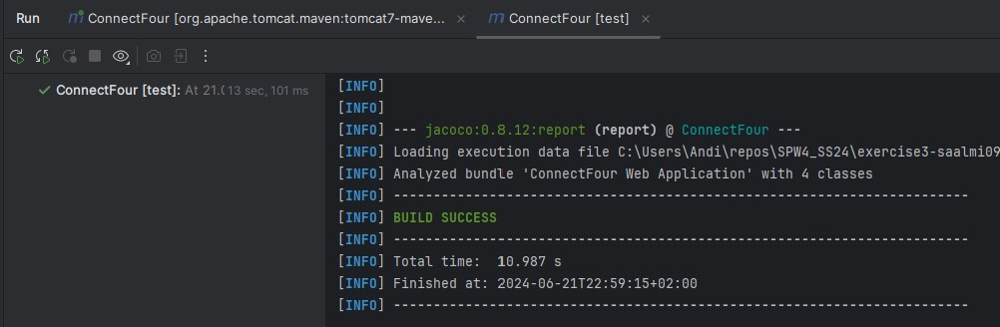
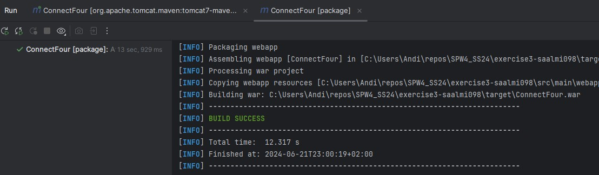
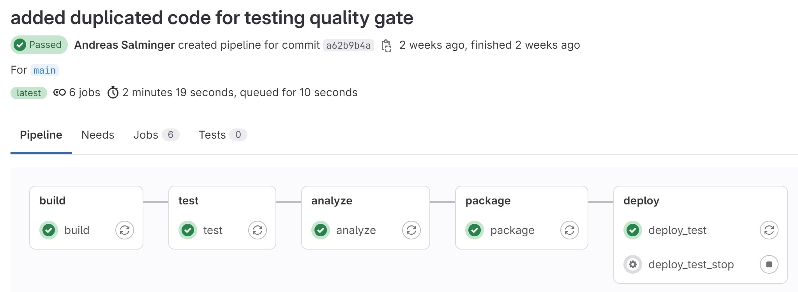

SPW4 - Exercise 3
=================

Name: Andreas Salminger

Effort in hours: __ TODO

## 1. Connect Four Web Application and CI/CD Pipeline

### Task 1.a

Task 1.a und 1.b wurden in der Übungsstunde gemeinsam umgesetzt, daher werden die einzelnen Schritte nicht im Detail dokumentiert, sondern nur die Ergebnisse.

Web-Applikation ConnectFour funktioniert:

`mvn compile`

`mvn test`

`mvn package`

### Task 1.b

### Task 1.c

Durchgeführte Schritte:

- Docker Desktop starten

- Schritte 1-6 aus `SETUP.md` ausführen (GitHub / Setup local CI/CD environment)

- Neues GitHub-Repo angelegt, weil in GitHub-Classroom keine Settings geändert werden können
    - `https://github.com/fhooe-se-spw4/exercise3-saalmi098` (TODO War nicht notwendig da schon vorhanden)
    - `cd exercise3-saalmi098`
    - `git remote add spw4-ue3 https://github.com/saalmi098/SPW4_UE3_SS24.git`
    - `git commit -am "Initial commit"`
    - `git pull spw4-ue3 main --rebase`
    - `git push spw4-ue3 main`

Teilschritte aus Schritt 6 (lt. GitHub-Settings Page):

#### Download

- Ordner erstellen
    - `mkdir actions-runner && cd actions-runner`
- Latest Runner Package herunterladen
    - `curl -o actions-runner-linux-x64-2.317.0.tar.gz -L https://github.com/actions/runner/releases/download/v2.317.0/actions-runner-linux-x64-2.317.0.tar.gz`
- Installer extrahieren
    - `tar xzf ./actions-runner-linux-x64-2.317.0.tar.gz`

#### Konfiguration
    
- Runner erstellen und starten
    - `./config.sh --url https://github.com/saalmi098/SPW4_UE3_SS24 --token AIJJTJG6Y43ZQLLDVQW5VM3GOYFEU`
        - Name: `spw4_ue3_runner`
    - `./run.sh`
- Workflow / Pipeline anpassen
    - `nano .github/workflows/pipeline.yml`

TODO : in pipeline.yml weitermachen -> pipelines definieren!