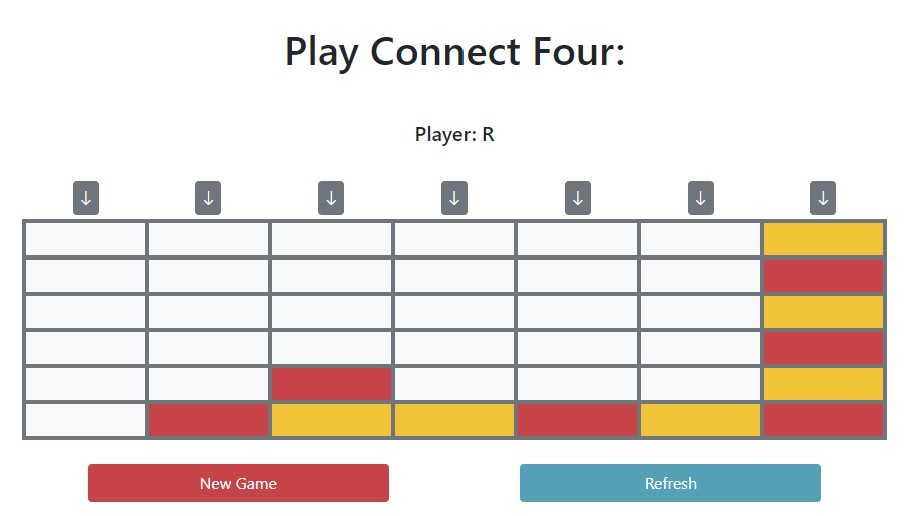

SPW4 - Exercise 3
=================

Name: Andreas Salminger

Effort in hours: __ TODO

## 1. Connect Four Web Application and CI/CD Pipeline

### Task 1.a

Task 1.a und 1.b wurden in der Übungsstunde gemeinsam umgesetzt, daher werden die einzelnen Schritte nicht im Detail dokumentiert, sondern nur die Ergebnisse.

Web-Applikation ConnectFour funktioniert:

`mvn compile`

`mvn test`

`mvn package`

### Task 1.b

### Task 1.c

Durchgeführte Schritte:

- Docker Desktop starten

- Schritte 1-6 aus `SETUP.md` ausführen (GitHub / Setup local CI/CD environment)